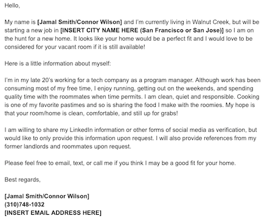
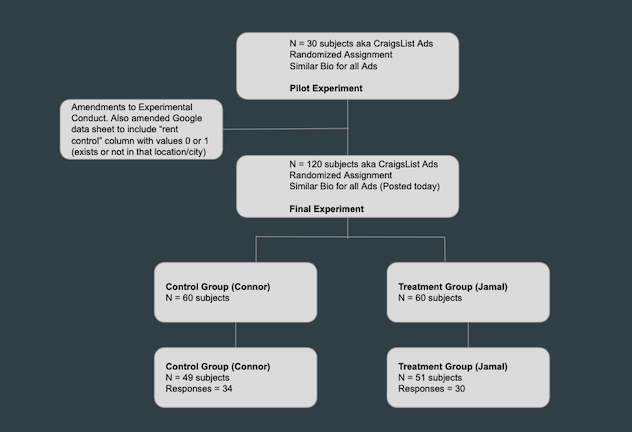

```{r, include=FALSE}
library(foreign)
library(data.table)
library(foreign)
if(!require(dplyr)){install.packages("dplyr");library(dplyr)}
if(!require(stargazer)){install.packages("stargazer");library(stargazer)}
if(!require(sandwich)){install.packages("sandwich");library(sandwich)}
if(!require(ggplot2)){install.packages("ggplot2");library(ggplot2)}
if(!require(pwr)){install.packages("pwr");library(pwr)}
if(!require(knitr)){install.packages("knitr");library(knitr)}


rental_raw <- read.csv('./Subject Recruitment and Treatment - Final Project - Cleaned Final Data.csv')
rental = rental_raw[-c(41:60),-c(1,6,10)]
rental$MonthlyRate_1000 = rental$Monthly_Rate/1000
```

## Abstract
This  experiment has been designed to gauge the extent of  racial biases between African American and Caucasian applicants in the shared housing market by responding to Craigslist advertisements placed in two regions of Bay Area, CA; San Francisco and South Bay. The goal of the experiment is to estimate the average treatment effect of receiving an application from an African American applicant and to collect key covariates in an attempt to improve the precision of our estimates. Our experimental design and randomization process allows for the non-interference assumption to hold and allows us to avoid certain biases in our estimates when running post experiment tests like regression and randomization inference. This paper addresses our experimental design in depth, how the experiment was conducted, analysis and discussion of the results, and final conclusion of the experiment.


# 1. Introduction Background
In 1963 California passed the Rumford Fair Housing Act in an attempt to combat racial discrimination in the rental housing market.^[1]^ This was a progressive measure at a time where racial discrimination was still a common practice throughout the US. Within less than a decade, the United States government followed suit and passed the fair housing act, which states that it is unlawful to refuse rent to any person because of race, color, national origin, and religion among other things.^[2]^ Despite these attempts to stem racial discrimination in the rental housing market, many studies aimed to evaluate whether racial discrimination biases still exist. Prior studies conducted by Andrew Hanson and Zackary Hawley measured racial biases by performing an audit study on the online housing market. Their research established that landlords receiving applications from “low-class” African Americans were significantly less likely to respond when compared to Caucasian applicants.^[3]^ The findings from this research are particularly troubling because not only is racial discrimination illegal, but, over 50 years later, this is still a problem this country faces today. 

Many audit studies conducted to date have attempted to estimate the extent of racial discrimination between landlords and prospective tenants, but a new form of renting has emerged in many metropolitan areas. In a world where cost of living has skyrocketed and student debt has reached insurmountable heights, shared housing has become a solution for many; especially among young working professionals. At the cost of one’s privacy, splitting housing expenses has offered young professionals an opportunity to live in trendy areas at reasonable rates. In San Francisco, and many other major cities around the world, applying to live in houses where someone has vacated one of the rooms has become a common practice. When applying to shared living situations such as these, the tenants are generally interested in getting to know the candidate before meeting them in person for an interview. For this reason, many online ads request information about the individual when applying for their home, much like applying for jobs. This is to get a sense of who the individual is, what they may be like as a prospective housemate, and to see if the candidate would be a good fit for their rental home. In the Craigslist world, where the internet serves as a barrier between the tenants and prospective applicant, it is important to evaluate whether racial biases exist among individuals who are evaluating applications. Understanding whether racial biases exist can help bring awareness to the Craigslist community and shape policies around how individuals are allowed to post and evaluate advertisements. For this reason, our research has focused on answering the following question:

When applying to a shared home, are there racial biases that would cause the reviewer of an application to favor one race over another?

The study we have conducted aims to estimate the extent of racial biases in the online housing rental community in three key ways that are different from prior research conducted by Andrew Hanson and Zackary Hawley and other researchers. First, we investigate the relationship between tenants and prospective applicants for a shared living situation. This is particularly interesting because we feel that this may lead to an increase in racial biases as the tenants may not be aware of the rental laws that protect prospective applicants. For this reason, racial biases may play a larger role in determining which candidates to move forward with in the rental evaluation process. Second, we attempt to estimate the heterogeneous treatment effects of African American applicants within communities that have rent control laws. Rent control laws allow tenants to secure a reasonable monthly rate, which they are able to keep year over year with very little increases in monthly rental costs. For this reason, it is within the the renter’s interest to keep renting the same home and may lead them to select prospective applicants in a more racially neutral manner. Lastly, Andrew Hanson and Zackary Hawley’s experimental design entailed applying two different conditions to the same landlord. In doing so, we believe this may have violated the non-interference assumption. Our experiment will only test one condition on each advertisement.

Although we hope our research finds that racial discrimination does not reside in the rental housing market, prior research would suggest otherwise. We hypothesize that the mean response rate for African American applicants will be significantly lower than Caucasian applicants in all measurements. Upon completing our experiment, we conduct randomization inference, linear regression, and evaluate heterogeneous treatment effects for rent controlled homes, homes with shared bathrooms, as well as the number of tenants that reside within the home (estimated by the number of rooms in the home).

## 2. Experimental Design 
We measure the mean response rate of master tenants for African American and Caucasian applicants by sending email responses to advertisements posted on Craigslist’s “rooms / shared” page. In order to test whether racial biases exist, we created a standardized email response to apply to vacant rooms of shared living homes on Craigslist. The subjects used in our study are the individuals that have taken the responsibility of filling a vacant room in a shared living situation. Each subject was randomized into either treatment or control conditions and applied treatment. Our primary outcome variable of interest will be to see if the rental application is able to successfully elicit a response from a master tenant.

## 2.1 Treatment
The goal of our experiment is to see if the mean response rate for Caucasian individuals was significantly different from that of African American individuals. In order to test this, we needed to create an association to a race with our application email. To address this challenge, we looked at the most common African American and Caucasian names in the US utilizing news resources and US census data to identify candidate applicant names.^[4, 5]^ We listed out candidate first and last names for our Caucasian and African American applications, and then voted on which pair to use. For control condition, we selected Connor Wilson as the name of the applicant to be appended to the email, and for treatment condition, we chose Jamal Smith as the name to include in our emails. After selecting our candidate names, we ran a LinkedIn search of the top 25 instances of these names to verify that the names we chose was representative of the associated races. We found that these names were in fact representative of the association we tried to create. The subsequent email addresses that were created were Connor.Wilson8712@gmail.com and Jamal.Smith3382@gmail.com. These names were used to help create a racial association through the name appended in the application as well as the email address used to apply to the ads. 

In order to ensure that we were able to make apples to apples comparisons between treatment and control, we had to create a standardized bio for our email response. The standardized bio had very minor adjustments, which included the name, email address appended at the bottom of the signature, and the city we were applying to so that we could ensure that the treatment and control profiles were comparable. In order to create a competitive application email, we audited 30 craigslist ads to identify what information was typically provided, as well as what information is typically asked of the applicant. Conducting this audit helped ensure that the information requested by the master tenant matches the information included in the standardized biographies, so that each applicant has a similar chance of receiving a response from the master tenant. Key components most craigslist ads asked for included reason for moving, link to LinkedIn or social media profiles, preferred method of contact, and some information about the applicant. It is important to note, we observed that most shared housing on craigslist mentioned that the individuals in the home were young working professionals. Many advertisements listed that tenants in the home were either in their 20’s or 30’s. We have attempted to consolidate this information and create a standardized profile that will cover most, if not all, of the bases that tenants are looking for. Figure 1 shows the template email that was generated after completing our audit.



We had to come up with creative ways to circumvent some core challenges of making a standardized email bio. For instance, we were unable to identify volunteers that were willing to be confederates in the study. For this reason, we did not have any LinkedIn or social media profiles to provide the application reviewer. Without having this information, we would run the risk of being filtered out for reasons other than race, which would ultimately bias our estimates and increase the number of false negatives. For this reason, we stated that we would provide social media information upon request to acknowledge that this information was asked for in the ad. Ideally, we would have had a profile to provide in our treatment, but this appeared not to be an issue after conducting our pilot study.

Please note that we may have a violation of excludability in our treatment. For instance, it is possible that individuals did not create an association to race when reviewing the application. Instead, an individual may choose to respond to the application because of other factors included in the treatment. They (the email reviewer) may find the job title (program manager) to be an appealing professional connection to make. In this case, we may bias our estimates and observe an overall higher response rate than would be expected. This is a hard challenge to overcome as almost every advertisement lists professional background of the tenants and requests this information of the applicant. Omitting this information could lead to no responses for reasons other than race. It is also possible that the last name chosen is common among other races. For instance, Smith is a prevelant last name in the UK, Australia, and the US. Although this is one of the most common surnames among African Americans, this is also common among Caucasian individuals. If one were to only review the last name, or create an association to race strictly based on the last name, then we may have not elicted the response we were looking for. Our hope is that the combination of the first and last name will elicit the association to race that we are looking for.

## 2.2 Subject Recruitment
Our subjects in this experiment were people whom we are defining as the the master tenant. These are the individuals who have taken the responsibility of filling a vacant rooms in a shared living situation and may not be the actual landlord who owns the property. In order to identify and recruit these subjects into our study, we looked to Craigslist’s “room / shared” page. Craigslist’s platform allows us to anonymously apply to housing advertisements, and is ideal for our experiment in three key ways. First and foremost, applying through an online interface via email minimizes the amount of interaction the researcher has with the subject. This helps mitigate the Hawthorne effect, which is when subjects alter their behavior because they know they are being studied.^[6]^ Second, we are able to standardize the treatment and control conditions in that we do not need to train confederates to participate in the study in any particular way. This ensures that our estimates from each group (treatment and control) are directly comparable. Lastly, applying through email allows us to better track precisely which subjects have responded to our treatment and control conditions. Another important feature of applying to advertisements for shared homes on Craigslist is that we are able to keep each treatment independent of each other. It is highly unlikely that tenants will be seeking to fill vacant rooms for multiple homes. We also believe that it is highly unlikely that master tenants will share the pool of applicants with other homes that are seeking to fill vacant rooms. For these reasons, we believe that the non-interference assumption holds, with each treatment being independent of each other and no spillover in our experimental design. 

For both the pilot study and actual experiment, we specifically recruited subjects from San Francisco and South Bay. Our target was to enroll 30 subjects into our pilot study, and a total of 120 subjects into our final study. 

## 2.3 Randomization 
Although we initially discussed the use of blocked randomization as a part of our experimental design, we decided to limit our study to the bay area; specifically San Francisco and South Bay. For this reason we did not see a need to add blocked randomization as we felt the difference in response rate between South Bay and San Francisco would be nominal. Prior to conducting this study, we created a randomization schedule at a 1:1 ratio utilizing cutting edge statistical software called R. It is important to note that we set a seed for this pseudo random randomization schedule so that we could reproduce the schedule if needed. The code used to create the randomization was provided by the W241 teaching staff.

## 2.4 Enrollment Criteria
Each subject enrolled into our study posted on Craigslist’s “room / shared” page to advertise a vacant room in their shared home. A key consideration for enrolling subjects into our study was the time between when an ad was posted to when we applied treatment or control conditions. It isn’t uncommon for shared housing advertisements to receive a lot of feedback, especially when the location is nice and the price is right. Applying to ads within the same day they were posted helped give the application a standing chance to be reviewed. We felt that this would help mitigate the number of false negatives in our outcome variable. This temporal aspect was also leveraged to ensure that treatment or control conditions would never be administered twice to the same ad by limiting which day each researcher could apply to ads on Craigslist. Another key consideration for enrolling subjects was the gender of the tenants within the home. A number of ads specifically called out that the applicant needed to be a female individual. In order to ensure that our application had a standing chance, we limited our recruitment of subjects to ads that did not specify gender requirements.

## 2.5 Outcome Measures
As mentioned previously, the measure of interest is whether or not an application received a response from the master tenant. This outcome measure was classified as a 1 once the master tenant responded to our application either via email, text, or phone call. 

**Key covariates that were also measured included the following:**

**Number of Rooms**  
We felt that the number of rooms could be a surrogate marker for the number of individuals  in the home. There could be a situation where larger groups of individuals living in a shared home may lead to less racial biases because a collective decision to rent to someone of a minority race might “dilute” these  biases, especially in progressive metropolitan areas like the Bay Area where no one wants to be perceived as a racist.

**Shared Bathroom**  
Whether or not a bathroom was shared was a common feature that was included in all craigslist advertisements. The inclusion of this variable may improve the estimates of the effect of treatment (Jamal) on response rates by controlling for the extent in which common space is shared between the master tenant(s) and the applicant.

**Monthly Rental Rate**  
Homes that have higher monthly rates may be rented by individuals who are more educated or in a higher paying job. Although this is an assumption, individuals who can afford more expensive rental rates may be less racially inclined when searching for housemates. Therefore, the inclusion of this covariate may improve the precision of our estimates on the effect of treatment on response rates.

**Region/Rent Control Laws**  
Among those that benefit from rent control laws, it is within the tenant’s interest to continue renting their home to maintain a lower monthly cost. For this reason, this may lead them to select prospective applicants in a more racially neutral manner. On the other hand, having a home that is under rent control laws may cause the master tenant(s) to be more selective in their application review process. This is because it is likely that the master tenant(s) will want to continue living in the same home for a long period of time. If this is the case, then the master tenant(s) may be very picky when choosing their next housemate.

**Photos**  
Although we would not expect the inclusion of photos to directly affect our outcome variable, we felt that doing so may help improve the precision of our estimates by controlling for how technology savvy the master tenant may be. It is also possible that by not posting photos of their place master tenants cater to less picky or less sophisticated prospective co-tenants. In which case he/she might not be bothered by prospective tenant’s race.

**Region and Greater Region**  
We have recorded the city for each advertisement so that we can evaluate which homes are under rent control. This study has been limited to San Francisco and South Bay. Although the variability observed between these two regions may be small, including other metropolitan areas may reveal heterogeneous treatment effects based on region.

**Available Now**  
Within craigslist, there is an option to include whether or not a rental property/room is available now. We felt that if a master tenant included “Available Now” in their advertisement then there was likely a sense of urgency to fill the vacant room and could therefore lead to a more racially neutral response rate. Although our hope is that our randomization process is robust, the inclusion of such a covariate could help improve the precision of our estimates by isolating the heterogeneous treatment effects between a home needing a tenant immediately, and homes that have time to sift through rental applications and be more selective of who they choose to move forward with. Unfortunately for this experiment, we decided to measure this covariate in the middle of our study. By the time we identified that this may be a good covariate to measure, many of the advertisements were already taken down so we were unable to obtain a complete list. 

# 3. Study Conduct
Here we present the flow diagram for our experiment (Figure 2). As stated earlier, after auditing 30 craigslist ads and creating a standardized bio, our team ran a pilot experiment to see what our response rates would be like. After observing the response rate from the pilot experiment, we modified the overall experimental design and began the final experiment for our study.



## 3.1 Pilot Experiment
For the pilot experiment we randomized 30 subjects into either treatment or control conditions at a ratio of 1:1 [15 treatment (Jamal) and 15 control (Connor) conditions]. At the start of our pilot experiment we identified a Google plugin named “Yesware” that could be used to secretly track who opened an email by embedding a single pixel image into the email content. This was exciting as it offered us an opportunity to measure intent to treat, and adjust our estimates to report the CACE. After applying to 10 ads and receiving no response, we identified that craigslist’s emailing system actively filtered out these emails so the subjects never received treatment. The remaining 20 subjects were treated without using “Yesware” to get a sense of response rates. Among the 20 ads, we received over 50% response rate, which was much better than we anticipated.

## 3.2 Experimental Conduct
After completing the pilot experiment and adjusting our experimental design, we created a randomization schedule (as stated in section 2.3) to apply either treatment or control conditions to 120 subjects. Each experimenter rotated shifts and administered 20 email responses each day for a total of 6 days. On day 3 (subjects 41 through 60) we observed that response rates were unusually low relative to all other treatment days. After investigating what went wrong, we identified that one of the researchers did not remove Yesware. As a result, a subset of our experiment randomly did not receive treatment or control conditions. Among the 100 individuals that were properly treated, a total of 49 subjects were administered the control application and a total of 51 subjects were administered the treatment application. The overall response rate for the 100 subjects who did receive treatment or control conditions was 64%.

# 4. Results
As stated in section 3.2, 20 subjects randomly did not receive treatment (subjects 41 through 60). For the purpose of our analysis, we removed these 20 records for a total of 100 subjects in our study. Of the 100 subjects, 49 subjects received control (Connor Wilson) and 51 subjects received treatment (Jamal Smith) conditions. We will present our results from our covariate balance check, statistical power analysis, estimated ATE from the experiment, randomization inference, as well as the results of our regressions and heterogeneous treatment effects.

## 4.1 Covariate Balance Checks
Before beginning our analysis, we wanted to ensure that the covariates were balanced across treatment and control groups. As you can see in Table 1, the randomization process seemed to be robust in that most covariates look fairly balanced. Note, the monthly room rate covariate seemed to have a more noticeable imbalance, with a slightly higher monthly rate for subjects in the control group (Figure 3). Although there is a small difference, we found that this was statistically insignificant and likely due to the small sample size of our study (p-value = 0.186). 


```{r echo = FALSE}

#check_sums = by(rental, rental$Treatment, summary)

check_sums = rental %>%
  group_by(Treatment) %>%
  summarise(Monthly_Rate = mean(Monthly_Rate), Photos = mean(Photos), Shared_Bathroom = mean(Shared_Bathroom), Rent_Control = mean(rent_control))

print("Table 1: Covariate Balance Check - Mean Values")
kable(check_sums)

mu = rental %>% group_by(Treatment) %>% summarise(grp.mean = mean(Monthly_Rate))

ggplot(rental) +
  geom_density(aes(x=Monthly_Rate, color=as.factor(Treatment)))+
  geom_vline(data=mu, aes(xintercept=grp.mean, color=as.factor(Treatment)),
             linetype="dashed") + ggtitle("Figure 3: Density Plot of Monthly_Rate by Treatment") +
  scale_color_manual(name="Treatment", 
                        labels = c("Connor", 
                                   "Jamal"), 
                        values = c("0"="#F8766D", 
                                   "1"="#00BFC4"))

#print("Table 2: Two Sample t-test of Monthly Rate by Treatment")
p_val = t.test(rental$Monthly_Rate[rental$Treatment == 1],
       rental$Monthly_Rate[rental$Treatment == 0])
```

We also see that the number of rooms within each home is very well balanced between treatment and control conditions by our randomization process (Figure 4).

```{r echo = FALSE}
ggplot(rental) +
  geom_density(aes(x=as.numeric(Rooms), color=as.factor(Treatment))) + ggtitle("Figure 4: Density Plot of Number of Rooms by Treatment") +
  scale_color_manual(name="Treatment", 
                        labels = c("Connor", 
                                   "Jamal"), 
                        values = c("0"="#F8766D", 
                                   "1"="#00BFC4")) + xlab("Number of Rooms")
```

## 4.2 Statistical Power
Statistical power is the probability that the test correctly rejects the null hypothesis. Before beginning the core of our analysis, we wanted to get a sense of statistical power measures to understand how likely we would be able to successfully reject the null hypothesis (mean response rates for African American and Caucasian individuals is the same) when the alternative hypothesis is true. To test this, we calculated Cohen’s d to estimate the effect size. Cohen’s d could be interpreted also as the percent of non-overlap between treatment group’s scores with those of the control group. The value for Cohen’s d came out to 0.219, which is typically considered a small effect size. Based on the effect size, we calculated our power to be 0.192, which is also very small. 


```{r echo = FALSE}

#Code taken from https://stackoverflow.com/questions/15436702/estimate-cohens-d-for-effect-size
cohens_d <- function(x, y) {
    lx <- length(x)- 1
    ly <- length(y)- 1
    md  <- mean(x) - mean(y)       ## mean difference (numerator)
    csd <- lx * var(x) + ly * var(y)
    csd <- csd/(lx + ly)
    csd <- sqrt(csd)                     ## common sd computation

    cd  <- md/csd                        ## cohen's d
}
res <- cohens_d(rental$Responded[rental$Treatment == 1], rental$Responded[rental$Treatment == 0])

pwr.t2n.test(n1 = length(rental$Responded[rental$Treatment == 0]), n2 = length(rental$Responded[rental$Treatment == 1]), 
             d = res , sig.level = 0.05, power = NULL)

```

In order to increase power to roughly 0.8 (assuming we observe the same effect size as n increases), our sample size would have to be at least 328 subjects in treatment and control groups (each). 

```{r echo = FALSE}
pwr.t.test(d=res, sig.level=.05, power = .80, type = 'two.sample')
```

## 4.3 ATE and T-test 
As we can see from Figure 5, although Connor Wilson (control condition) had a smaller sample size than Jamal Smith (treatment condition), Connor received more responses (34 versus 30, respectively). The estimated average treatment effect for our study came out to be -0.106, which was statistically insignificant (p-value = 0.2752). Although we have failed to reject the null hypothesis, based on our statistical power test, we feel that increasing the sample size may reveal a statistically significant result.

```{r echo = FALSE}
response_rates = rental %>%
  group_by(Treatment, Responded) %>%
  summarise(count = n())

response_rates$Responded[response_rates$Responded == 0] = "No Response"
response_rates$Responded[response_rates$Responded == 1] = "Responded"


ggplot(response_rates,aes(x=Responded,y=count,fill=factor(Treatment)))+
  geom_bar(stat="identity",position="dodge")+
  scale_fill_discrete(name="Treatment",
                      breaks=c(0, 1),
                      labels=c("Connor", "Jamal"))+
  xlab("Responded to Application")+ylab("Count") + scale_x_discrete(labels=c("0" = "No Response", "1" = "Response",
                              "2" = "Dose 2")) + ggtitle("Figure 5: Count of Outcome Variable for Treatment and Control")

```

## 4.4 Randomization inference 
Randomization inference can be a strong tool for evaluating the null hypothesis that there is no effect. By only modifying the randomization (and not the outcome), we are, in essence, able to fill in the unobserved potential outcomes and estimate the difference in means. Figure 6 shows the results from our randomization inference experiment. The p-value under the sharp null was 0.3001 (two-tailed), which further confirms our findings in section 4.3.

```{r echo = FALSE}
set.seed(123)

ATE = mean(rental$Responded[rental$Treatment == 1]) - mean(rental$Responded[rental$Treatment == 0])

rental_rand_inf = rental

ones = sum(rental$Treatment)
zeros = length(rental$Treatment) - ones

randomize <- function() sample(c(rep(0,zeros),rep(1,ones)))

est_ate = function(){
  rental_rand_inf$new_treat = randomize()
  pos = rental_rand_inf %>%
  group_by(new_treat) %>%
  summarize(avg = mean(Responded))
  est_ate = pos$avg[pos$new_treat == 1] - pos$avg[pos$new_treat == 0]
  return(est_ate)
}

check = replicate(10000, est_ate())
hist(abs(check), main = "Figure 6: Estimated ATEs from Randomization Inference", xlab = "Absolute Value of Estimated ATEs")
abline(v = abs(ATE), col = "red")

pval = mean( abs(check) >= abs(ATE))

paste('p-value (two-tailed) from the randomization experiment =', pval)

```

## 4.5 Linear Regression and Estimating Heterogeneous Treatment Effects 

### 4.5.1 Linear Regression
We conducted a simple series of regressions to investigate each variable’s relationship with response rate. As seen in Column 1 of Figure 7, the results of the naive regression with only treatment as an independent variable reveals results consistent with our calculated ATE and randomization inference. We find that the effect of receiving treatment resulted in an insignificant decrease in response rate. Although this result is not statistically significant, we believe that increasing the sample size may lead to a significant result. 

Next, we looked at the relationship between response rate, and treatment, rent control, and monthly room rate. For the purpose of regression analysis, we have transformed the monthly room rate variable by dividing each of the values by 1,000. As you can see in Column 2 of Figure 7, monthly room rate had a significant coefficient of 0.272, which means that more expensive rooms lead to a higher response rate. Although we do not believe this statistically significant result is valid, this result is likely due to the difference in room rates between San Francisco and South Bay. It is highly unlikely that the amount of money a room costs directly affects response rate, but it may instead be a surrogate variable for the types of people who are posting the advertisement. Previously, we discussed how the standardized treatment bio may violate the excludability assumption. We feel that the relationship between response rate and monthly room rate may be highly affected by the job we have chosen to list in our treatment (program manager). It is possible that had we chosen a lower paying job (e.g., janitor), our response rates observed for higher monthly rate houses would be much lower. Unfortunately, we are not able to evaluate this relationship within the scope of our experimental design.

For our last regression we took a kitchen sink approach and regressed response rate on all variables we measured (Column 3, Figure 7). Once again, we find that the monthly room rate has a statistically significant coefficient of 0.336. Although statistically indistinguishable from zero, to our surprise, the coefficient on photos is positive. As mentioned previously, the inclusion of photo may help control for how tech savvy an individual is, and may also help control for those that care about the home’s aesthetics. Increasing the sample size may reveal an interesting relationship with this covariate.

```{r echo = FALSE}
new_data = rental

new_data$Rooms = as.numeric(new_data$Rooms)

naive_model = lm(Responded ~ Treatment, data = new_data)
rse.model = sqrt(diag(vcovHC(naive_model)))

kitchen_sink_model_1 = lm(Responded ~ Treatment + rent_control + MonthlyRate_1000 , data = new_data)
rse.model_ks = sqrt(diag(vcovHC(kitchen_sink_model_1)))
                 
kitchen_sink_model = lm(Responded ~ Treatment + rent_control + MonthlyRate_1000 + Photos + Shared_Bathroom + Rooms + Greater_Region, data = new_data)
rse.model_ks2 = sqrt(diag(vcovHC(kitchen_sink_model)))

stargazer(naive_model,kitchen_sink_model_1, kitchen_sink_model, type = "text", omit.stat = "f",
se = list(rse.model,rse.model_ks,rse.model_ks2), title = "Figure 7: Regression Analysis",
star.cutoffs = c(0.05, 0.01, 0.001))
```


```{r include=FALSE}
SF = subset(rental, Greater_Region == "San Francisco")
SB = subset(rental, Greater_Region == "South Bay")

model_SF = lm(Responded ~ Treatment + MonthlyRate_1000 + Photos + rent_control, data = SF)
rse.modelSF = sqrt(diag(vcovHC(model_SF)))

model_SB = lm(Responded ~ Treatment + MonthlyRate_1000 + Photos + rent_control, data = SB)
rse.modelSB = sqrt(diag(vcovHC(model_SB)))

stargazer(model_SF, model_SB, type = "text", omit.stat = "f",
se = list(rse.modelSF, rse.modelSB),
star.cutoffs = c(0.05, 0.01, 0.001))

t.test(SF$MonthlyRate_1000, SB$MonthlyRate_1000)

```


### 4.5.2 Heterogeneous Treatment Effects
Our team was interested in investigating the heterogeneous treatment effect of rent control, number of rooms (as a surrogate marker for the number of roommates), and shared bathrooms. For this reason, we conducted regression analysis and included these key covariates as interaction terms.

We first investigated the interaction between treatment and rent control to see if there were any significant relationships between these two variables (Column 1, Figure 8). Although we observed that the interaction between treatment and rent control was not statistically significant, we did find that rent control lead to a statistically significant reduction in response rate. This may be a spurious statistical finding, but it is important to note that in all of our regressions, rent control has had a negative coefficient, which indicates that master tenants who reside in homes under rent control may be more selective in their screening process across the board. This may be because tenants recognize that they may live with a selected individual for a long time given the nature of the benefits of rent controlled homes. For this reason, it is in the master tenant’s interest to be more selective of who they choose to live with. We also observed that the inclusion of rent control as a covariate has reduced the standard error of our coefficient on treatment. Although this is not statistically significant, increasing the sample size may lead to a statistically significant coefficient.

A key omitted variable in our data is the number of roommates in a home. It is possible that an increased number of roommates can lead to diluted racial biases because individuals may not want to be classified as a racist. Although it can be argued that a racist master tenant may never share the application of an African American individual with the rest of the home, we still feel that it is important to control for the number of individuals in the home. To do this, we are using the number of rooms in a home as a surrogate marker for the number of individuals in a home. It is important to note that we are interested in the effect of each additional roommate in a home. For this reason, we are treating Rooms as a numeric variable (rather than categorical). The regression analysis shows that there is no statistically significant difference between treatment and control conditions when including the interaction term Rooms (Column 2 of Figure 8).

Lastly, we were interested in evaluating the heterogeneous treatment effects of sharing a bathroom. Previously, our team hypothesized that the addition of shared bathroom as a covariate may reveal a difference in the estimated response rate for Jamal over Connor. As we can see from the results of the regression, the effects of sharing a bathroom seems to be negligible (Column 3, Figure 8).


```{r echo = FALSE}
model_RC = lm(Responded ~ Treatment + rent_control + rent_control * Treatment, data = new_data)
rse.model1 = sqrt(diag(vcovHC(model_RC)))

model_Roommate = lm(Responded ~ Treatment + Rooms + Rooms * Treatment, data = new_data)
rse.model2 = sqrt(diag(vcovHC(model_Roommate)))

model_SharedBR = lm(Responded ~ Treatment + Shared_Bathroom + Shared_Bathroom * Treatment, data = new_data)
rse.model3 = sqrt(diag(vcovHC(model_SharedBR)))

stargazer(model_RC, model_Roommate, model_SharedBR, type = "text", omit.stat = "f",
se = list(rse.model1, rse.model2, rse.model3), title = "Figure 8: Heterogeneous Treatment Effects",
star.cutoffs = c(0.05, 0.01, 0.001))
```

# 5. Discussion and Conclusion
We set out to identify whether being an African American applicant lead to significantly reduced response rates among master tenants when compared to Caucasian applicants. To do so, we designed an experiment that allowed for the non-interference assumption to hold, and used a randomization design to help combat issues around omitted variable bias. Our study was limited to the Bay Area -- San Francisco and South Bay -- with an overall response rate of 64% for our study. Although our findings were not statistically significant, we find that the treatment application (African American - Jamal Smith) had a reduced response rate when compared to control (Caucasian - Connor Wilson). It is important to note that based on our power analysis, we found that our experiment was underpowered. Increasing the sample size may lead to statistically significant outcomes. When trying to control for heterogeneous treatment effects, we find that properties with rent control may lead to a reduction in overall response rate, but these results will need to be further tested in more cities. As it stands, we have only conducted our study in the Bay Area, where San Francisco and San Jose have rent control laws. Given that the majority of our subjects are taken from these pools, it is possible that the effects we see on rent control may be reduced (or exaggerated) when expanding these analyses to other cities. We also identified that monthly room rate may play a factor in response rates. This is because monthly room rates could be a covariate that helps control for the types of people that are looking to fill the vacant room. For example, those that can afford higher rent may have higher paying jobs and very demanding careers. They may seek to rent rooms to people with a similar background or similar economic status. If this is the case, then higher monthly room rates may in fact lead to a larger response rate for Jamal Smith when he is listed as a program manager, but may have a lower response rate if his job was listed as a janitor or social worker. It may be interesting to investigate this relationship further, especially if these data were paired with region specific data on cost of living.

As mentioned in section 2.1, we may have a violation of excludability due to the nature of the material requested of many Craigslist advertisements. Specifically, the inclusion of hobbies and professional background may bias our estimates in that master tenants may latch onto these attributes of the application rather than the associated race of the applicant. Although our hope is that the randomization process is robust to these biases and that the selected names create a strong enough association to race, excludability may have been violated in some ways. A more robust experimental design would include two different classes of individuals -- those with prestigious jobs, and those without. If the overall reduction in response rates were consistent in both groups (low and high class) for the African American treatment, then we could make a stronger argument that racial biases do in fact play a role in whether or not a master tenant decides to respond to an application. We also previously mentioned that the names we chose may have not elicited an association to race in the way we had hoped. Although we chose some of the most common first and last names among African American and Caucasian men within the US, there is a chance that this was not strong enough to elicit racial biases among tenants. If this is the case, then this may be a reason for why we observed a negligable difference in response rates in our experiment. A more robust experimental design would include many different combinations of the most common African American and Caucasian names. The analysis would then look at the results in aggregate. For the scope and timing of this project, it would have been difficult to implement this.

We would also like to acknowledge that these results may not be as generalizable as we had hoped. For one, most advertisements looked to fill rooms with individuals that are of similar age. These ages tended to range between mid 20’s to mid 30’s. The age requirement in many advertisements may be an artifact of changing times in that shared living among working professional is only a recent phenomenon and currently affects a very specific demographic. This could also be because key life events have not happened for individuals in these age ranges. For instance, people who get married or have children may not be interested in sharing their home with others. It is possible that as time progresses, older individuals will look to share living expenses with others. We also only evaluated the effect of male African American and Caucasian applicants. Although we wanted to test the effect of female applicants as well, we determined that this would be too difficult to execute within the scope of the timeline we had to complete this experiment. 

In conclusion, we are excited to report that we were unable to detect statistically significant differences in response rates between African American and Caucasian applicants in the Bay Area’s shared housing market. There are a few experimental design modifications that we would like to pursue in future studies. 

These include:  

* Evaluate gender specific differences.  
* Introduce factorial design and create an association to class by introducing grammatical errors and/or including different job types.  
* Diversify the number of different names used for each race.  
* Recruit subjects from other metropolitan communities, including communities outside of California (e.g., Oakland, Berkeley, Atlanta, Dallas, Phoenix, Detroit).  
* Implement block-randomized design to block on geographic location.  
* Increase the sample size to ensure sufficient power for our experiment.  
* Implement measures to determine the total number of roommates residing in shared housing (using number of rooms might be not a good surrogate for estimate of this sort).  
* Include “Available Now” covariate from Craigslist to control for the urgency of filling a room.  
* Although response rate was greater than 50% in our study, estimating ITT and CACE may still be useful, especially if certain cities have much lower response rates. For this reason, we would recommend identifying software like Yesware that would allow one to successfully estimate ITT.  

# References

^[1]^ “1964 California Proposition 14.” Wikipedia, Wikimedia Foundation, 15 Dec. 2018, en.wikipedia.org/wiki/1964_California_Proposition_14#Rumford_Fair_Housing_Act.

^[2]^ “Fair Housing Act.” Wikipedia, Wikimedia Foundation, 11 Oct. 2018, en.wikipedia.org/wiki/Fair_Housing_Act.

^[3]^ Hanson, Andrew, and Zackary Hawley. “Do Landlords Discriminate in the Rental Housing Market? Evidence from an Internet Field Experiment in US Cities.” Journal of Urban Economics, vol. 70, no. 2-3, Sept. 2011, pp. 99–114., doi.org/10.1016/j.jue.2011.02.003.

^[4]^ “Top 20 'Whitest' and 'Blackest' Names.” ABC News, ABC News Network, 21 Sept. 2006, abcnews.go.com/2020/top-20-whitest-blackest-names/story?id=2470131.

^[5]^ Mongabay. “Most Common Black or African-American Last Names (Non-Hispanic).” Mongabay-Names, 8 Aug. 2012, names.mongabay.com/race/2010/population-black.html.

^[6]^ “Hawthorne Effect.” Wikipedia, Wikimedia Foundation, 7 Nov. 2018, en.wikipedia.org/wiki/Hawthorne_effect.

^[7]^ Field experiments, Alan S. Gerber, Donald P. Green, 2012, Chapters 4.1-4.3, 5.2, 13


